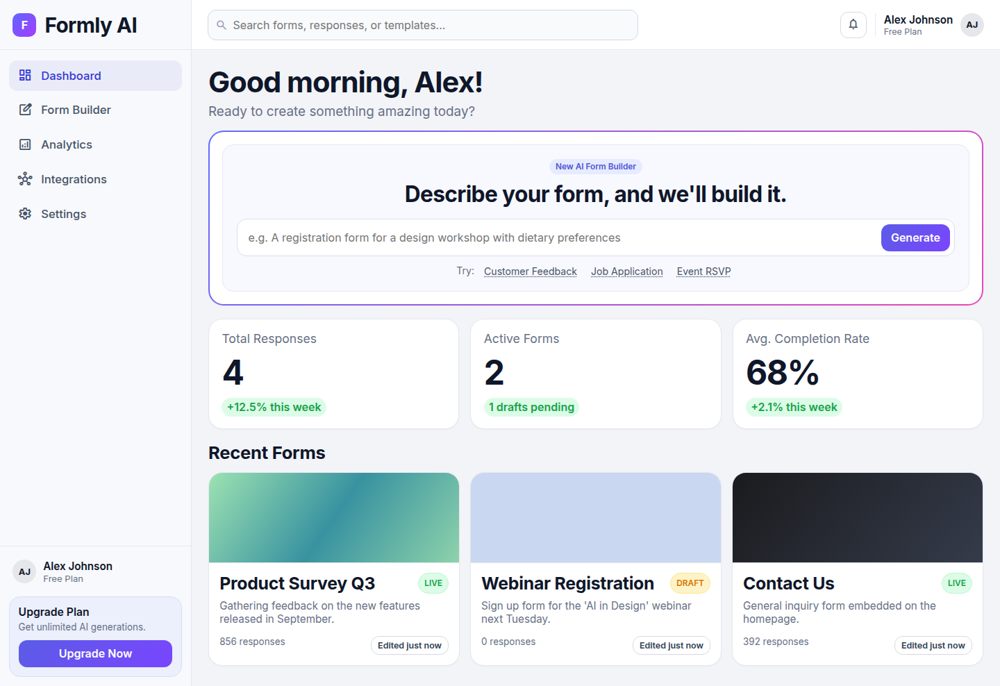

# Formly

**Describe a form in plain English → get a working form back.** The AI model runs entirely in your browser, so no server, API key, or data leaves your machine.

> 💡 Think of Formly as Google Forms with an assistant who drafts the questions for you, and that assistant lives inside your browser tab instead of on someone else's server.



---

## ⚡ Run it in 30 seconds

```bash
python main.py            # needs Python 3.13+, no packages to install
```

Then open **http://127.0.0.1:8000** in Chrome or Edge (they support WebGPU, which makes it fast).

| Page | URL | What it's for |
|---|---|---|
| Dashboard | `/` | See your forms, start a new one |
| AI Builder | `/builder.html` | Chat with the AI to build a form |
| Analytics | `/analytics.html` | Responses and charts for a form |

Screenshots of every page are in the [Overview](docs/01-overview.md#the-three-pages).

Options: `python main.py --port 9000 --host 0.0.0.0`

---

## 📚 Docs: read in this order

| # | Page | Read it if you want to… | Time |
|---|---|---|---|
| 1 | [Overview](docs/01-overview.md) | Understand what Formly is and how the pieces fit | 3 min |
| 2 | [How AI generation works](docs/02-how-generation-works.md) | Follow a prompt from text box to rendered form | 5 min |
| 3 | [Code map](docs/03-code-map.md) | Find which file to edit for a given change | 3 min |
| 4 | [Form schema & data](docs/04-schema-and-data.md) | Understand the JSON format and where data is saved | 4 min |
| 5 | [FAQ & troubleshooting](docs/05-faq.md) | Fix something that isn't working | 2 min |

---

## 🧱 Tech at a glance

- **Frontend:** plain HTML + CSS + vanilla JavaScript (ES modules). No build step, no framework, no `npm install`.
- **AI runtime:** [WebLLM](https://github.com/mlc-ai/web-llm) on WebGPU, with [Transformers.js](https://huggingface.co/docs/transformers.js) on WASM as a fallback for browsers without WebGPU.
- **Models:** small language models (SLMs) of about 0.5B–2B parameters. Default: Qwen 2.5 1.5B.
- **Storage:** the browser's `localStorage`. There is no database.
- **Server:** `main.py` is only a static file server for local development. The site can be deployed to any static host (e.g. Netlify).

## 🔗 Useful links

- [WebLLM](https://github.com/mlc-ai/web-llm) · [Transformers.js](https://huggingface.co/docs/transformers.js) · [Can I use WebGPU?](https://caniuse.com/webgpu) · [Qwen models](https://huggingface.co/Qwen)
