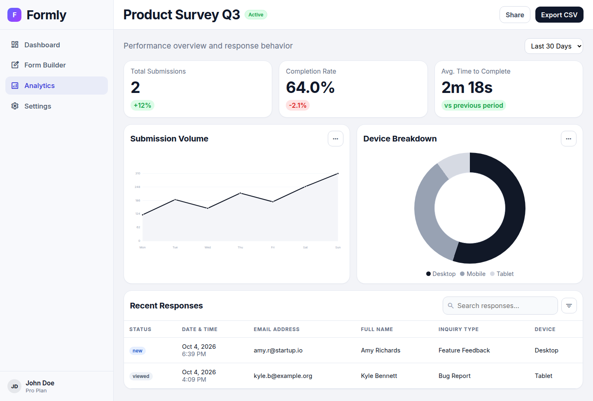

# 1. Overview

⬅️ [Back to README](../README.md) · Next ➡️ [How AI generation works](02-how-generation-works.md)

---

## The one-sentence version

You type *"Make a workshop registration form"* and a small AI model **in your browser** writes the form as JSON. Formly then checks that JSON and turns it into a live preview you can keep refining.

## The analogy 🍳

Think of a restaurant kitchen:

| Kitchen | Formly |
|---|---|
| The customer's order | Your prompt |
| The recipe card the chef must follow | The **system prompt** (tells the model to output JSON in a fixed shape) |
| The chef | The **small language model** running on your GPU |
| The plate the chef hands over | The model's **JSON output** |
| The head chef who fixes messy plates before they go out | **`schema.js`**: it cleans, repairs and validates the JSON |
| The backup cook when the chef is unavailable | The **heuristic fallback**: built-in templates used if the model fails |
| The dining room | The **live form preview** |

A key point: **the head chef always checks the plate.** Small models often produce messy JSON, so Formly never trusts the raw output. It always goes through repair and normalization first.

## The three pages

```
┌──────────────┐  type a prompt   ┌──────────────┐   publish    ┌──────────────┐
│  Dashboard   │ ───────────────► │  AI Builder  │ ───────────► │  Analytics   │
│ (index.html) │ ◄─ open a form ─ │(builder.html)│              │(analytics.   │
└──────────────┘                  └──────────────┘              │   html)      │
                                                                └──────────────┘
          all three read and write the same localStorage state
```

### 🏠 Dashboard (`index.html`)

Summary cards (total responses, active forms, completion rate), a list of recent forms and a prompt box. Typing a prompt sends you to the Builder with `?prompt=...` in the URL, and generation starts right away.


### ✨ AI Builder (`builder.html`)

The main page. On the left is a chat with suggested follow-up prompts; on the right is the live form preview, with the raw JSON underneath. **Model and Prompt Settings** (bottom left) let you choose the model, max tokens and temperature, and edit the system prompt.


> This screenshot was taken offline, so the status chip reads *"Used fallback generation"*. The form came from the built-in **registration template** (see [Step 5](02-how-generation-works.md#step-5-fallback-if-anything-fails-heuristicpayload)). With the model loaded, the chip reads *"Form updated from model output on webgpu"*.

### 📊 Analytics (`analytics.html`)

Metrics, a weekly submissions line chart, a device breakdown ring and a searchable responses table for the active form.



## What's real vs. demo data

Being clear about this saves confusion:

| Real | Demo / placeholder |
|---|---|
| ✅ AI form generation (on-device) | 🟡 Responses and analytics come from **seeded sample data** in `storage.js` |
| ✅ Saving and publishing forms (in localStorage) | 🟡 Trend badges (e.g. "+12%") are hard-coded |
| ✅ Live form preview | 🟡 "Publish" changes status to *live*, but doesn't host a public form or collect real submissions |

## Key ideas to remember

- **No backend.** Everything happens in the browser, and `main.py` only serves files.
- **WebGPU first, WASM fallback.** It's fast on a GPU and slower (but still working) on a CPU.
- **Never crash on bad AI output.** The parse → repair → fallback chain always produces a usable form.
