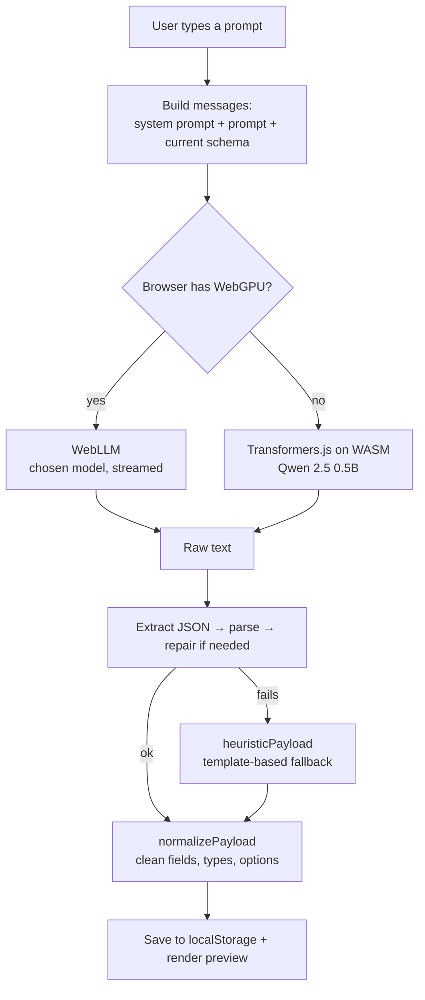
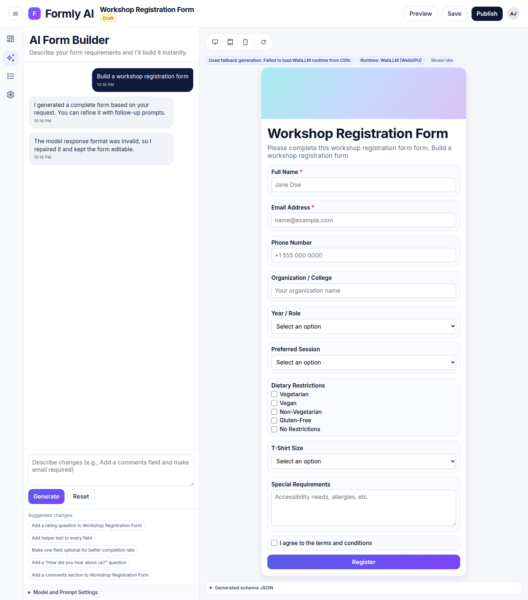

# 2. How AI generation works

⬅️ [Overview](01-overview.md) · Next ➡️ [Code map](03-code-map.md)

---

This page follows one prompt from start to finish.

## The pipeline in one picture



## Step by step

### Step 1: Build the messages (`model-client.js → composeMessages`)

The model receives two messages:

- **system:** the system prompt from `config.js` (editable in the Builder UI). It tells the model to reply with *only* JSON, which field types to use and what the JSON should look like.
- **user:** your prompt **plus the current form schema**.

Because the current schema is included, follow-up prompts like *"add a phone number field"* change the existing form instead of starting from scratch. It works like editing a shared doc rather than writing a new one each time.

### Step 2: Pick a runtime (`hasWebGPU()`)

| | WebGPU path | WASM fallback |
|---|---|---|
| Library | WebLLM (`@mlc-ai/web-llm`) | Transformers.js (`@huggingface/transformers`) |
| Model | Your choice from 7 (default **Qwen 2.5 1.5B**) | Fixed: **Qwen 2.5 0.5B** |
| Speed | Fast, runs on the GPU | Slow, runs on the CPU |
| Streaming | Yes (you see a live character count) | No |

Both libraries are loaded from a CDN **only when first needed**, and the loaded model is cached in memory, so the second prompt is much faster than the first.

> 📦 **The first run downloads the model** (about 0.5–1.5 GB). The browser caches it, so later visits skip the download.

### Step 3: Turn messy text into JSON (`parseJsonFromText`)

Small models are like a new intern: they mostly follow the format, but sometimes wrap the answer in ```` ```json ```` fences, add chatty text, or stop halfway through. The parser handles this in stages:

1. **Extract:** take the content of the last code fence, or the last complete `{...}` object, or everything from the first `{` onward.
2. **Parse:** try `JSON.parse`.
3. **Repair:** if parsing fails, remove trailing commas, convert `'single'` quotes to `"double"`, quote bare keys, strip control characters and **auto-close** any unclosed `}` or `]`.
4. If it still fails, throw an error, which triggers the fallback in Step 5.

### Step 4: Normalize (`schema.js → normalizePayload`)

Even valid JSON can be *wrong*, so every field is cleaned up:

- **Type aliases → canonical types.** For example, `"multiple_choice"` becomes `radio` and `"dropdown"` becomes `select`. If the type is unknown, it's guessed from the label (a label containing "email" becomes `email`).
- **Option fields always get options.** If the model forgot the options for a `radio`/`select`, Formly infers sensible ones from the label (a "Rating" label gets Excellent → Very Poor, an "Experience" label gets Beginner / Intermediate / Advanced…).
- **IDs** are made unique. A missing ID is generated from the label in `snake_case`.
- **Missing placeholders** get sensible defaults.

### Step 5: Fallback if anything fails (`heuristicPayload`)

If the model fails to load or its output can't be repaired, Formly builds the form **without AI**:

1. It checks the prompt for keywords that match one of **7 built-in templates**: feedback, registration, survey, contact, job application, RSVP/event, booking/order.
2. If none match, it adds fields based on keywords found in the prompt.
3. Prompts containing *create / new / build / make / generate* start a fresh form; other prompts add to the current one.

The chat then shows: *"The model response format was invalid, so I repaired it and kept the form editable."* Here's what that looks like for the prompt *"Build a workshop registration form"*:



### Step 6: Save and render

`builder.js` saves the form to localStorage, adds the assistant's message to the chat, updates the suggestion chips (from the model's `suggested_next_prompts`) and re-renders the preview and JSON panel.

## Settings you can tweak in the Builder

| Setting | Default | What it does |
|---|---|---|
| Model | Qwen 2.5 1.5B | Bigger models are smarter but slower to download and run. *Phi 3.5 Mini* is labelled "best JSON". |
| Max tokens | 1024 | Output length cap. If it's too low, the JSON gets cut off (repair often saves it). |
| Temperature | 0.7 | Lower = more predictable output; higher = more creative. For strict JSON, 0.3–0.5 is safer. |
| System prompt | see `config.js` | The "recipe card". Edit it to change the model's behaviour without touching code. |
| dtype (WASM only) | `q4` | Quantization level. Lower bits mean a smaller, faster model with slightly lower quality. |
